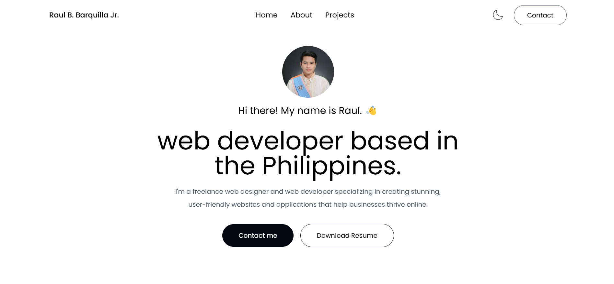

<h1 align="center">🚀 Raul Barquilla Jr. - Next.js Portfolio</h1>

 
   
   
   

---

## 🌟 About Me

Welcome to my personal portfolio built with **Next.js** and **Tailwind CSS**. It showcases my web development skills and projects with:

- 🚀 **Smooth Single-Page Navigation** powered by Framer Motion animations.
- ⚡ **Optimized Performance** using Next.js and Vercel.
- 🎨 **Modern & Responsive UI** designed with Tailwind CSS.
- 🔧 **Reusable Components** for easy scalability and maintainability.

---

## 🛠 Tech Stack

### 🔹 Frontend

### 🔹 Deployment

---

## 📸 Live Preview

🔗 **[Check out my live portfolio](https://raulbarquilla-portfolio.vercel.app/)**

  
    

---

## ⚡ Features

- ✅ **Responsive Design** – Works seamlessly on mobile and desktop.
- ⚡ **Fast Navigation** – Quick transitions between sections.
- ♿ **Accessibility Focused** – Built with best practices for all users.
- 🚀 **Optimized Performance** – Ensures smooth browsing on all devices.

---

## 📫 Contact

📧 **Email:** raulbarquilla003@gmail.com  
📌 **Facebook:** [Raul Barquilla Jr.](https://www.facebook.com/raulbarquillajr)
