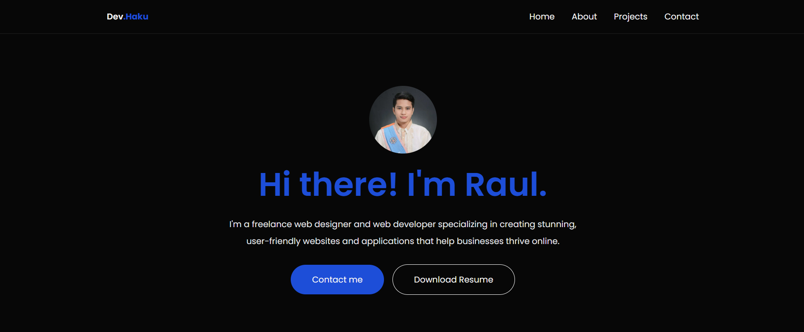

# 🚀 Raul Barquilla Jr. - Next.js Portfolio

 
 
 
 

## 🌟 About Me

Welcome to my personal portfolio built with Next.js and Tailwind CSS. It showcases my web development skills and projects with:

- 🚀 Smooth Single-Page Navigation with Framer Motion animations.
- ⚡ Optimized Performance using Next.js and Vercel.
- 🎨 Modern and Responsive UI designed with Tailwind CSS.
- 🔧 Reusable Components for easy scalability and maintainability.

## 🛠 Tech Stack

🔹 Frontend:
  

- Next.js
- React
- Tailwind CSS
- Framer Motion

  

🔹 Deployment:
  

- Vercel

## 📸 Live Preview

  🔗 <strong><a href="https://raulbarquilla-portfolio.vercel.app/">Check out my live portfolio</a></strong>

  

## ⚡ Features

- Responsive Design: Seamlessly adapts to mobile and desktop views.
- Fast Navigation: Quick transitions between sections.
- Accessible: Built with accessibility in mind for all users.
- Optimized Performance: Ensures smooth browsing experience on all devices.

## 📫 Contact

Feel free to reach out to me:

- Email: raulbarquilla003@gmail.com
- GitHub: https://github.com/hakkuuuu
